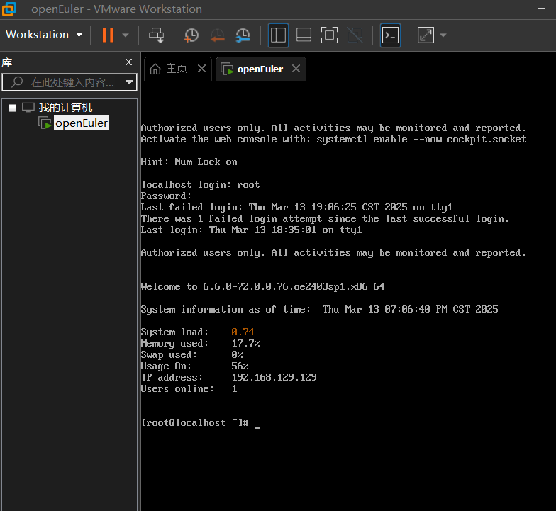

# openEuler 安装过程

---
## 准备工作
- **镜像下载**:  
  访问[openEuler官网](https://openeuler.org/)下载最新ISO镜像。
  
- **VMWARE下载**

## 安装过程
1.1 打开VMware创建虚拟机

 

1.2 选择默认

1.3 选择稍后安装

1.4 选择Linux 版本选择其他Linux 5.x 内核 64位

1.5 设置虚拟机名称及安装位置

1.6 选择处理器数量及内核

1.7 分配内存

1.8 网络类型选择NAT

1.9 控制器类型和磁盘类型选择默认

1.10 创建新的虚拟磁盘，并分配大小

1.11 设置完成

2.1 编辑虚拟机设置

2.2 选择下载的镜像文件

2.3 启动虚拟机,选择第一个直接安装

2.4 完成root设置,以及安装功能的选择。

2.5 安装完成

