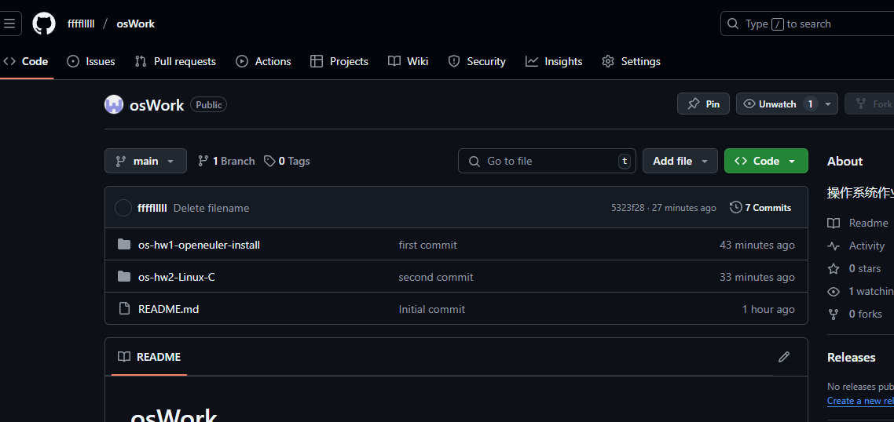

# 使用Git创建os实验项目与多线程编程

## git的使用
1.使用git绑定用户名与邮箱

2.生成ssh,便于github免密登录

3.github添加生成的ssh

4.使用github创建os实验项目

5.克隆到本地并建立远程连接上传之前的项目

6.创建成功

## 多线程编程
1.基本多线程程序设计
编写如下代码使用 pthread 库创建一个线程并输出 "Ciallo world!"

2.多线程性能测试
编写如下代码进行多线程计算和单线程计算对比

运行结果如下图

